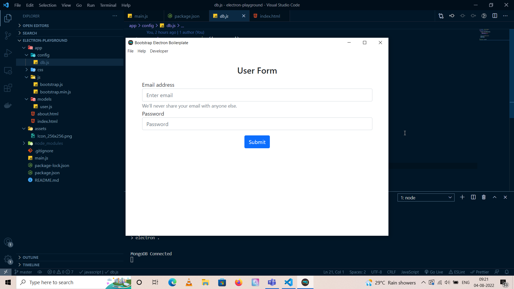
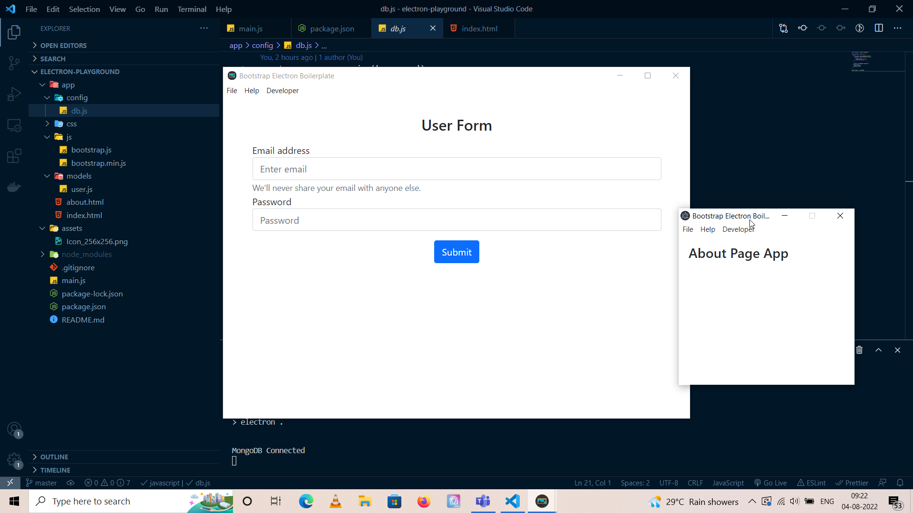

# Desktop App Development in Electron - Starter


## Project Briefing

This is a simple starter boilerplate I plan to use in building desktop applications using Electron. Electron makes it easy for web developers to be able to build cross platform desktop applications from scratch using Javascript, HTML and CSS. Popular Javascript frameworks like React and Vue can also be leveraged to create desktop based applications. Cool, isn't it ?

## About Electron

The Electron framework lets you write cross-platform desktop applications using JavaScript, HTML and CSS. It is based on Node.js and Chromium and is used by the Atom editor and many other apps.

## Authors

* **Amit Prafulla (APFirebolt)** - (https://apgiiit.com/)

## Project setup

Project is initialized using npm package manager under Node environment. Create a new folder and initialize it as an npm project, then install Electron.

```
npm install electron --save-dev
```

Electron is a cross platform tool for building desktop applications and has ability to create binaries or executables for the platform you're using. I used the following scripts for building binaries for Windows, Linux and Mac environments.

```
"scripts": {
    "start": "electron .",
    "dev": "nodemon --exec electron .",
    "package-mac": "electron-packager . --overwrite --platform=darwin --arch=x64 --icon=assets/icons/mac/icon.icns --prune=true --out=release-builds",
    "package-win": "electron-packager . --overwrite --platform=win32 --arch=ia32 --icon=assets/icons/win/icon.ico --prune=false --out=release-builds --version-string.CompanyName=CE --version-string.FileDescription=CE --version-string.ProductName=\"ImageShrink\"",
    "package-linux": "electron-packager . --overwrite --platform=linux --arch=x64 --icon=assets/icons/png/1024x1024.png --prune=false --out=release-builds"
  },
```

## Database Architecture

This contains a very simple integration of local Mongodb instance on top of Mongoose to use with your application. It only as a User model with 'email' and 'password' fields. Database connection is made inside a config file much like I have been doing in my past MERN/MEVN projects.

```
const mongoose = require('mongoose')

const connectDB = async () => {
  try {
    const conn = await mongoose.connect(
      'mongodb://localhost/electron-user',
      {
        useNewUrlParser: true,
        useUnifiedTopology: true,
      }
    )

    console.log('MongoDB Connected')
  } catch (err) {
    console.log(err)
    process.exit(1)
  }
}

module.exports = connectDB
```

Modules do not work with Electron for some reason so I have been using 'require' in place of regular imports which I often use in my other projects.

## Project Features

- Contains basic boilerplate for building cross platform desktop apps using Electron.
- Integrates with Bootstrap 5 for UI components.
- It is connected to MongoDB database.
- It has a Menu and additional app window which would be opened through a click event.

## Project Screenshots

Screenshots would be added as progress is made with this application. Screenshot of the main window. A captured it while developing it inside VSCode XD



Screenshot of the smaller pop-up window which would be opened through a click event on the Menu item of the main window.



## Project Status

The most important features of the project is complete and ready to use. There is a possibility of adding minor features like adding comments for resolved complaints in the future. The project approximately took one week time for completion, I was working on other projects including my organisation projects as well meanwhile.
